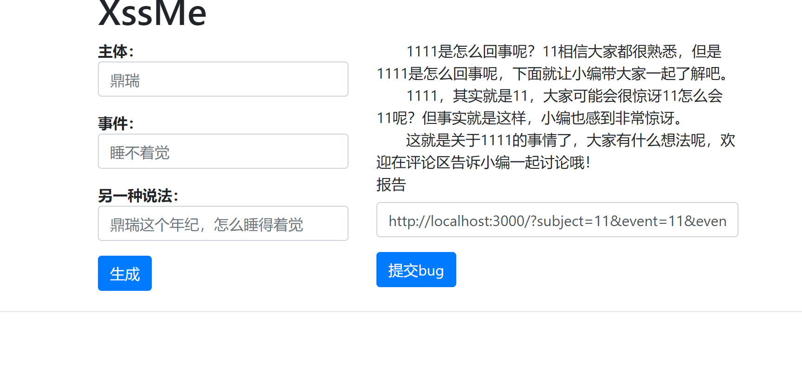
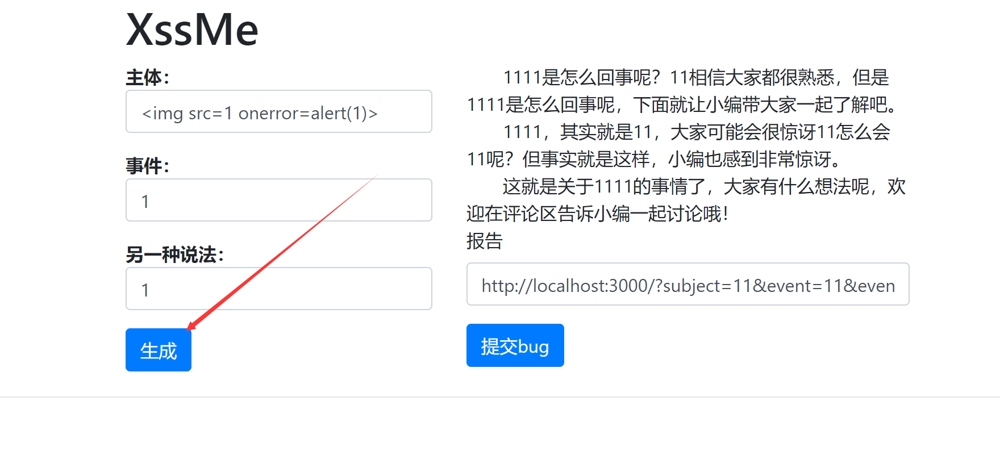
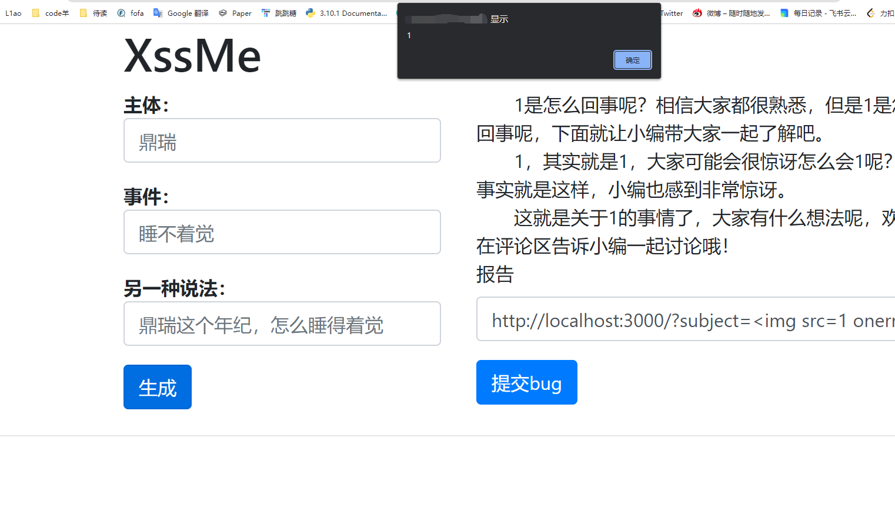
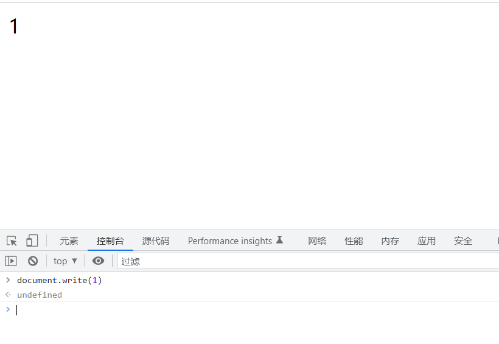
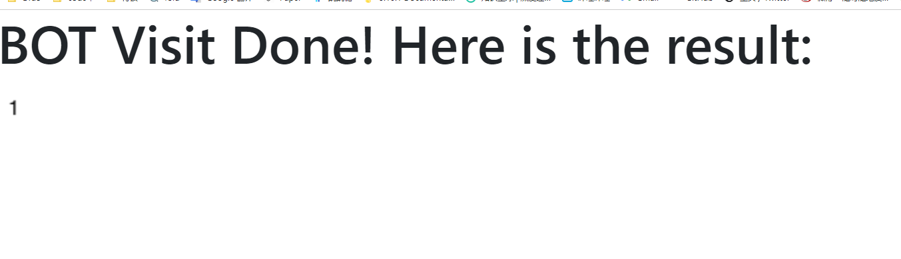
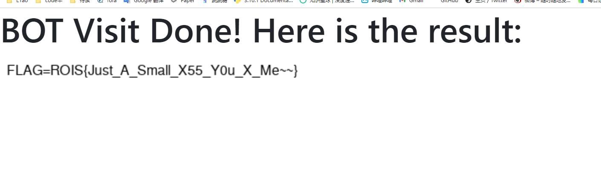
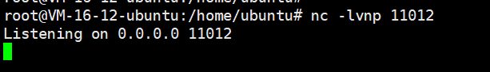
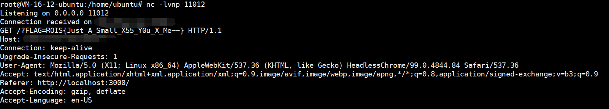

## [Week2]XssTest

- hint1：DOM XSS, GET FLAG FROM COOKIE

- hint2：结合所学JavaScript知识，如果你能执行任意JavaScript代码便可以操控浏览器做一些事情，如果你有服务器(vps)的话可以选择外带cookie，如果没有的话这里提供了截图功能，想办法把cookie输出到页面然后让bot去截图返回~~~
  alert()会导致页面一直加载bot截图不了，请尝试其他函数，eg：document.write()
  ps：多思考，多尝试

访问：http://101.43.57.52:28081/?subject=1&event=1&event2=1

返回内容：



题目给出源码，查看逻辑

```javascript
function generate() {
    const currentURL = new URL(window.location.href);
    subject = currentURL.searchParams.get("subject");
    event = currentURL.searchParams.get("event");
    event2 = currentURL.searchParams.get("event2");
    document.getElementById("reportform").value = "http://localhost:3000/?subject=" + subject + "&event=" + event + "&event2=" + event2;
    if (subject.length == 0 || event.length == 0 || event2.length == 0)
        return;
    result = `　　${subject}${event}是怎么回事呢？${subject}相信大家都很熟悉，但是${subject}${event}是怎么回事呢，下面就让小编带大家一起了解吧。<br>　　${subject}${event}，其实就是${event2}，大家可能会很惊讶${subject}怎么会${event}呢？但事实就是这样，小编也感到非常惊讶。<br>　　这就是关于${subject}${event}的事情了，大家有什么想法呢，欢迎在评论区告诉小编一起讨论哦！`;
    document.getElementById("result").innerHTML = result;
    auto_grow(document.getElementById("result"));
}
```

前端处理url参数来生成页面内容，按xss分类为domxss

在domxss中如果使用script标签js不会被执行，因为后面加的js不会被浏览器加载

通过学习html，xss等内容。往html中插入图片，图片加载失败触发js执行可以来dom xss（还有其他方式不一一列举）

https://websec.readthedocs.io/zh/latest/vuln/xss/payload.html

尝试里面的payload，我用的是：``



这里来测试你的payload



这里alert会使得浏览器没有加载完，截图会超时

### 两种解决方法

- 1（没有服务器来外带cookie情况下）通过往页面写入cookie（flag在cookie中）然后bot截图返回，已知``中js代码为我们可以插入执行js的地方，现在我们只需要找个js函数，把cookie写入页面即可，通过翻文档/百度，找到`document.write()`函数，当然其他能够进行页面操作的都可以，控制台尝试可以往页面写入东西了，payload: ``提交报告：`http://localhost:3000/?subject=&event=null&event2=null`返回往页面写入cookie，payload: ``提交报告：`http://localhost:3000/?subject=&event=null&event2=null`返回
- 2 (有服务器来外带cookie情况下) 服务端nc监听端口，然后利用js来发送网络请求，payload: ``提交报告：http://localhost:3000/?subject=&event=1&event2=1返回
